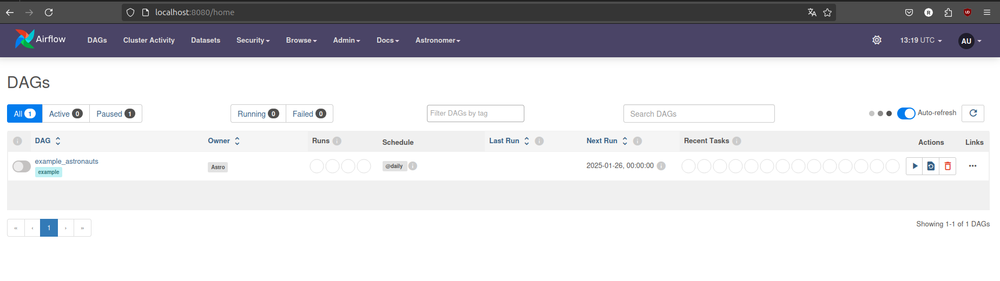
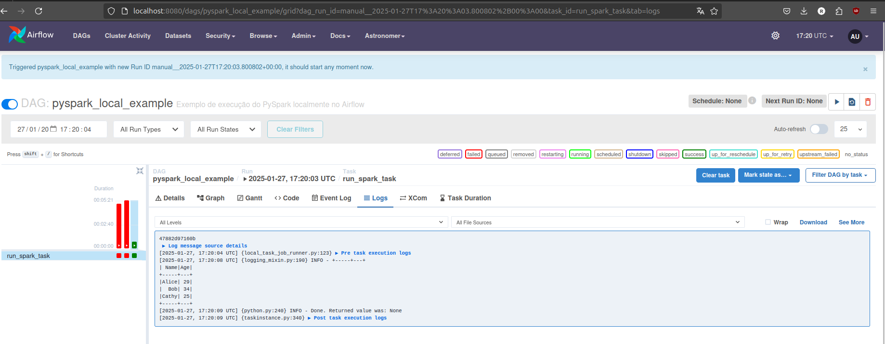

# Sistema de Engenharia de Dados Financeiros

<!-- ABOUT THE PROJECT -->
Este projeto é um sistema escalável de engenharia de dados para processamento e análise de dados financeiros em tempo real, utilizando Airflow, Spark, Databricks e Docker.

# Feito Com

Abaixo segue o que foi utilizado na criação deste projeto:

- [Minikube](https://minikube.sigs.k8s.io/docs/start/) - Ferramenta de código aberto que permite criar um ambiente de teste do Kubernetes em sua máquina local. Com o Minikube, é possível criar e implantar aplicativos em um cluster Kubernetes em sua máquina local.
- [Helm](https://helm.sh/) - Ferramenta de gerenciamento de pacotes de código aberto para o Kubernetes. O Helm permite empacotar aplicativos Kubernetes em um formato padrão chamado de gráfico, que inclui todos os recursos necessários para implantar o aplicativo, incluindo configurações e dependências.
- [Spark](https://spark.apache.org/) - O Spark é um framework de processamento de dados distribuído e de código aberto, que permite executar processamento de dados em larga escala, incluindo processamento em batch, streaming, SQL, machine learning e processamento de gráficos. Ele foi projetado para ser executado em clusters de computadores e fornece uma interface de programação fácil de usar para desenvolvedores;
- [Airflow](https://airflow.apache.org/) - O Airflow é uma plataforma de orquestração de fluxo de trabalho de dados de código aberto que permite criar, agendar e monitorar fluxos de trabalho complexos de processamento de dados. Ele usa uma linguagem de definição de fluxo de trabalho baseada em Python e possui uma ampla gama de conectores pré-construídos para trabalhar com diferentes sistemas de armazenamento de dados, bancos de dados e ferramentas de processamento de dados;
- [Postgres](https://www.postgresql.org/) - O Postgres é um sistema de gerenciamento de banco de dados relacional de código aberto, conhecido por sua confiabilidade, escalabilidade e recursos avançados de segurança. Ele é compatível com SQL e é usado em uma ampla gama de aplicativos, desde pequenos sites até grandes empresas e organizações governamentais.

## Pré-requisitos
Nenhum

### Instalação Kubernates
```sh
curl -LO https://storage.googleapis.com/minikube/releases/latest/minikube-linux-amd64
sudo install minikube-linux-amd64 /usr/local/bin/minikube
minikube start --driver=docker --memory=8000 --cpus=2
minikube dashboard
```
Para acessar alguns serviços via loadbalancer no Minikube, é necessário utilizar o [tunelamento do minikube](https://minikube.sigs.k8s.io/docs/handbook/accessing/#example-of-loadbalancer). Para isso, abra uma nova aba no seu terminal e execute o seguinte comando:
```sh
minikube tunnel
```
O Ingress no Kubernetes é um recurso que permite expor serviços rodando no cluster para o mundo externo, utilizando um único ponto de entrada. 
```sh
minikube addons enable ingress
```
Neste exemplo vou usar o astro da Astronomer para criação do Airflow, este processo é mais simples
```sh
curl -sSL https://install.astronomer.io | sudo bash
astro dev init
astro dev start
```


Após o airflow, fiz algumas alterações no DockerFile para subir o Pyspark junto, o melhor cenário seria subir o spark em um JOB separado no K8s.



