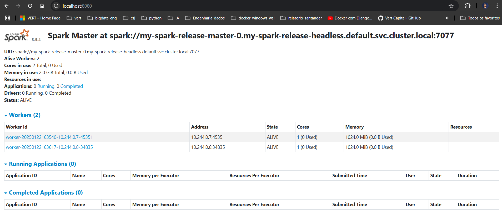

# Sistema de Engenharia de Dados Financeiros

<!-- ABOUT THE PROJECT -->
Este projeto é um sistema escalável de engenharia de dados para processamento e análise de dados financeiros em tempo real, utilizando Kubernetes, Airflow, Spark, Databricks e Docker.

# Feito Com

Abaixo segue o que foi utilizado na criação deste projeto:

- [Minikube](https://minikube.sigs.k8s.io/docs/start/) - Ferramenta de código aberto que permite criar um ambiente de teste do Kubernetes em sua máquina local. Com o Minikube, é possível criar e implantar aplicativos em um cluster Kubernetes em sua máquina local.
- [Helm](https://helm.sh/) - Ferramenta de gerenciamento de pacotes de código aberto para o Kubernetes. O Helm permite empacotar aplicativos Kubernetes em um formato padrão chamado de gráfico, que inclui todos os recursos necessários para implantar o aplicativo, incluindo configurações e dependências.
- [ArgoCD](https://argo-cd.readthedocs.io/en/stable/) - Ferramenta declarativa que usa a abordagem GitOps para implantar aplicações no Kubernetes. O Argo CD é gratuito, tem código aberto, é um projeto incubado pela CNCF, e possui uma interface web de visualização e gerenciamento dos recursos, mas também pode ser configurado via linha de comando.
- [Spark](https://spark.apache.org/) - O Spark é um framework de processamento de dados distribuído e de código aberto, que permite executar processamento de dados em larga escala, incluindo processamento em batch, streaming, SQL, machine learning e processamento de gráficos. Ele foi projetado para ser executado em clusters de computadores e fornece uma interface de programação fácil de usar para desenvolvedores;
- [Airflow](https://airflow.apache.org/) - O Airflow é uma plataforma de orquestração de fluxo de trabalho de dados de código aberto que permite criar, agendar e monitorar fluxos de trabalho complexos de processamento de dados. Ele usa uma linguagem de definição de fluxo de trabalho baseada em Python e possui uma ampla gama de conectores pré-construídos para trabalhar com diferentes sistemas de armazenamento de dados, bancos de dados e ferramentas de processamento de dados;
- [Reflector](https://github.com/emberstack/kubernetes-reflector) - O Reflector é uma ferramenta de sincronização de estado de código aberto que permite sincronizar recursos Kubernetes em diferentes clusters ou namespaces. Ele usa a abordagem de controlador de reconciliação para monitorar e atualizar automaticamente o estado dos recursos Kubernetes com base em um estado desejado especificado;
- [Minio](https://min.io/) - O Minio é um sistema de armazenamento de objetos de código aberto e de alta performance, compatível com a API Amazon S3. Ele é projetado para ser executado em clusters distribuídos e escaláveis e fornece recursos avançados de segurança e gerenciamento de dados;
- [Postgres](https://www.postgresql.org/) - O Postgres é um sistema de gerenciamento de banco de dados relacional de código aberto, conhecido por sua confiabilidade, escalabilidade e recursos avançados de segurança. Ele é compatível com SQL e é usado em uma ampla gama de aplicativos, desde pequenos sites até grandes empresas e organizações governamentais.

## Pré-requisitos
Nenhum

### instalação do cluster Kubernates
Cluster Kubernetes local para executar a aplicação e o pipeline de dados. Cluster de Kubernetes **[minikube](https://minikube.sigs.k8s.io/docs/)**. [Instalação do Minikube](https://minikube.sigs.k8s.io/docs/start/).

Também usaremos o **[helm](https://helm.sh/)** para nos ajudar a instalar algumas aplicações. [Siga este guia de instalação para instalar o Helm](https://helm.sh/docs/intro/install/).

Após instalar esses pré-requisitos, é hora de iniciar o nosso cluster Minikube. Para que tudo ocorra bem, é aconselhável usar um cluster de no mínimo 8GB de memória e 2 CPUs. Execute o seguinte comando no terminal:
```
minikube start --driver=docker --memory=8000 --cpus=2
```
Vou usar o kubernetes-dashboard para isso utilizarei a configução via yaml
```
minikube dashboard
```

### Ferramentas

Será necessário instalar algumas aplicações que serão responsaveis por manter e gerenciar nosso pipeline de dados.

Estando conectado em um cluster Kubernetes, execute os seguintes comandos para criar todos os namespaces necessarios:

```sh
kubectl create namespace orchestrator
kubectl create namespace database
kubectl create namespace ingestion
kubectl create namespace processing
kubectl create namespace datastore
kubectl create namespace deepstorage
kubectl create namespace cicd
kubectl create namespace app
kubectl create namespace management
kubectl create namespace misc
```

Spark
```sh
helm repo add spark https://charts.bitnami.com/bitnami
helm repo update
helm install my-spark-release spark/spark
kubectl get pods
```
execute o comando  kubectl get services para UI
```sh
kubectl get services
kubectl port-forward service/my-spark-release-master-svc 8080:80
```



Airflow
```sh
helm repo add apache-airflow https://airflow.apache.org/
helm repo update
helm install airflow apache-airflow/airflow --namespace airflow --create-namespace
```